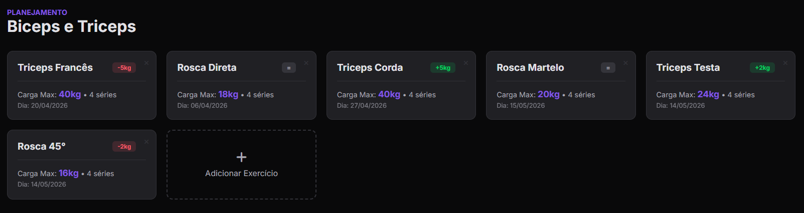
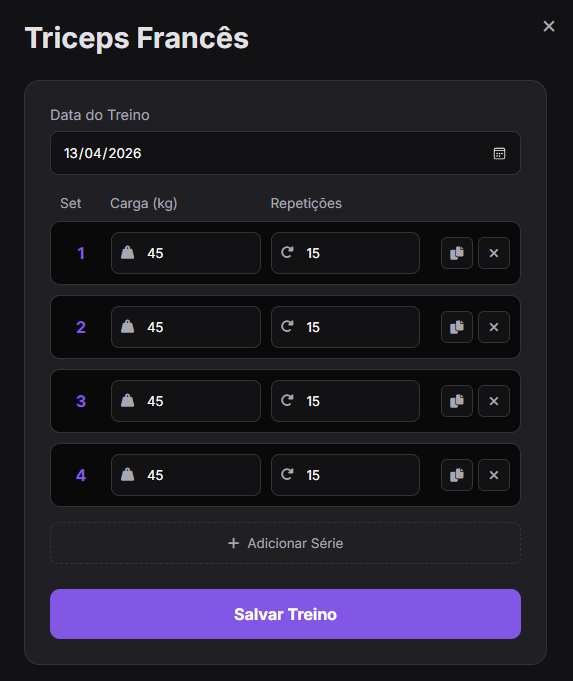
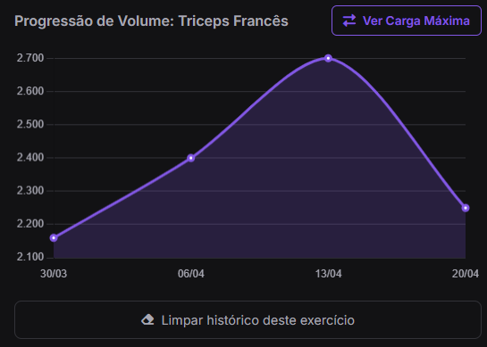

# 🏋️‍♂️ GymTracker

Um web app focado em musculação, projetado para rastrear a evolução de cargas e o volume total de treino. Desenvolvido para facilitar a aplicação da **sobrecarga progressiva** e garantir consistência nos resultados.

## 🚀 Funcionalidades

* **Gerenciamento de Rotinas:** Crie divisões personalizadas (ex: Push/Pull/Legs) e adicione seus exercícios.
* **Registro Detalhado:** Anote séries, repetições e carga (kg) de forma rápida com o botão de duplicar séries.
* **Gráficos Dinâmicos:** Visualize sua evolução através de gráficos gerados automaticamente. Alterne entre:
  * **Carga Máxima:** Acompanhe seu pico de força no dia.
  * **Volume Total:** Acompanhe o esforço total (Carga x Repetições x Séries) focado em hipertrofia.
* **Comparações Inteligentes:** O sistema compara seu treino atual com o anterior e exibe *badges* de progressão (ex: `+2kg`).
* **Segurança de Dados:** Os dados são salvos localmente no navegador (`localStorage`), com opções de exportar (Backup em `.json`) e importar arquivos para não perder o histórico.
* **Design Responsivo:** Interface fluida (Dark Mode) que funciona perfeitamente em telas de desktop e mobile.

## 🛠️ Tecnologias Utilizadas

* **HTML5:** Estruturação semântica.
* **CSS3:** Estilização com variáveis globais, Flexbox e CSS Grid. Responsividade nativa sem frameworks.
* **JavaScript (Vanilla):** Lógica de manipulação de DOM, cálculos de volume e gerenciamento de armazenamento local.
* **Chart.js:** Renderização do gráfico de progressão em canvas.

## ⚙️ Como usar

Este projeto não requer instalação de pacotes ou servidores complexos.

1. Faça o clone ou o download deste repositório.
2. Abra o arquivo `index.html` no seu navegador web preferido.
3. Comece a registrar seus treinos!

### 📸 Demonstração

  <table>
    <tr>
      <td colspan="2" align="center">
        
      </td>
    </tr>
    <tr>
      <td align="center" width="50%">
        
      </td>
      <td align="center" width="50%">
        
      </td>
    </tr>
  </table>

